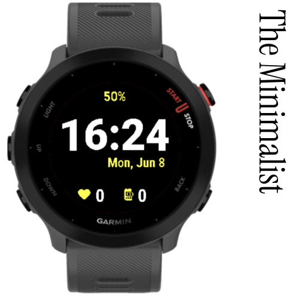

# GarminWatchFace



A custom Garmin Connect IQ watch face for the **Forerunner 55**, built with Monkey C.

## Features

- Large digital time display
- Date shown right-aligned below the time
- Battery percentage at the top in accent lime/green (`#C8E600`)
- Heart rate with icon (bottom left)
- Step count with icon, formatted as `55.8k` for values ≥ 1 000 (bottom right)

## Requirements

- [Garmin Connect IQ SDK](https://developer.garmin.com/connect-iq/sdk/) 3.4.0 or later
- [Visual Studio Code](https://code.visualstudio.com/) with the [Monkey C extension](https://marketplace.visualstudio.com/items?itemName=garmin.monkey-c)
- A Garmin developer key (`developer_key`)

## Project Structure

```
manifest.xml              # App manifest (id, type, permissions, target devices)
monkey.jungle             # Build configuration
source/
  GarminWatchFaceApp.mc   # Application entry point
  GarminWatchFaceView.mc  # Watch face rendering logic
resources/
  drawables/              # Icons and launcher image
  layouts/                # Layout XML (unused – drawn programmatically)
  strings/                # App name string resource
```

## Building & Running

1. Open the project folder in VS Code.
2. Press **Cmd + F5** to build and launch in the simulator for the `fr55`.
3. Make sure `monkey.jungle` points to your developer key path, or pass `-y /path/to/developer_key` in the build task.

## Supported Devices

| Device        | ID     |
| ------------- | ------ |
| Forerunner 55 | `fr55` |

Additional devices can be added by inserting `<iq:product id="..."/>` entries in `manifest.xml`.

## License

MIT
